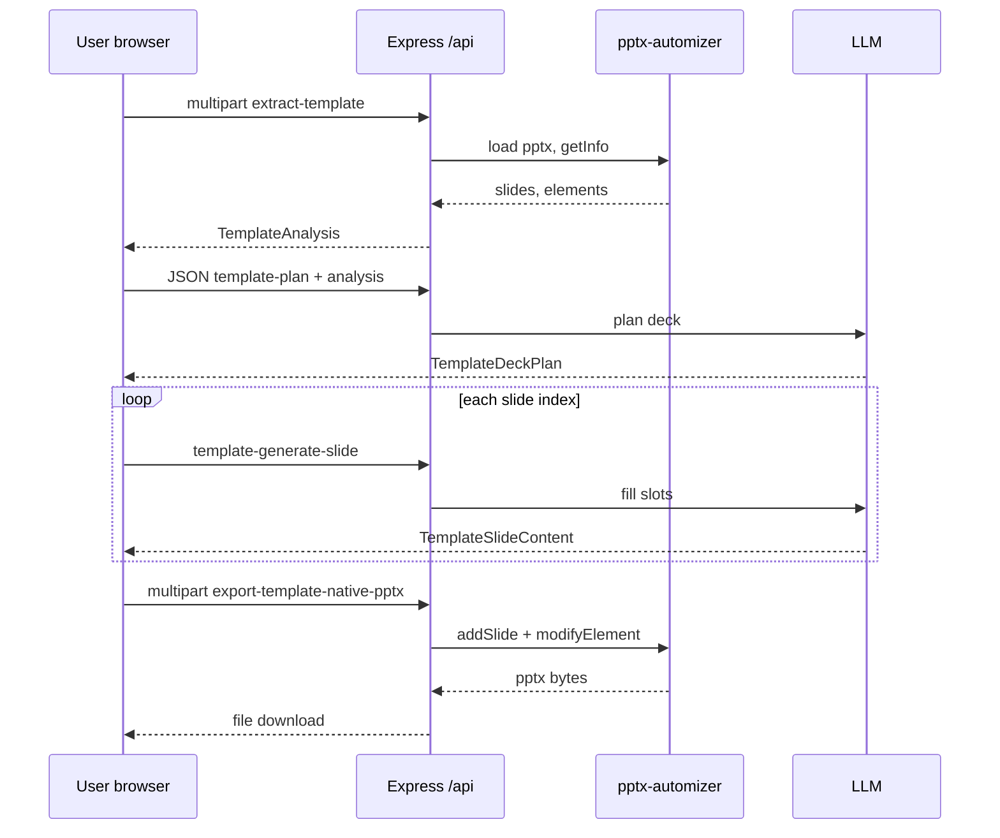

# pptx-automizer integration and the Test Page workbench

This document explains how **pptx-automizer** fits into the DSlide project, how it relates to **PptxGenJS**, what landed on branch **`extract/ready-pttx`** compared to **`main`**, and how the **Test Page** wires the generic template flow end-to-end. It also describes how to extend the system (new endpoints, slot behavior, export modes).

---

## 1. Executive summary

| Layer | Technology | Role |
|-------|------------|------|
| Primary app (main product flow) | **PptxGenJS in the browser** | Builds `.pptx` from structured `Presentation` / `SlideData` after the LLM returns JSON. Described historically in [PPTX_PIPELINE.md](./PPTX_PIPELINE.md). |
| Template / brand path (this branch) | **pptx-automizer on the server** | Loads a user-supplied `.pptx`, inspects slides and shapes, optionally merges PptxGenJS-generated content into cloned slides, or **modifies text in-place** on cloned slides. |

**pptx-automizer** is the bridge between “real PowerPoint files” (masters, themes, existing geometry) and programmatic fills. The project uses it for:

1. **Inspection** — walk every slide, list elements, infer roles, build stable `slotId`s and selectors (`name`, `creationId`).
2. **Layout-mapped export** — `exportPresentationWithTemplate`: clone prototype slides by **logical `SlideLayout`** (title, content, chart, …) and redraw content with **PptxGenJS** inside automizer’s `slide.generate()` callback (parity with client geometry).
3. **Template-native export** — `exportTemplateNativePresentation`: clone slides chosen by **template layout id** and inject text with **`ModifyTextHelper.setText`** + `islide.modifyElement()` (preserves native styling for text slots; v1 is text-only on editable non-decorative shapes).

The **Test Page** (`client/src/TestPage.tsx`) still runs the original **client-only** PptxGenJS buttons. Below those, **`TemplateWorkbench`** is the UI that exercises the **server + automizer** pipeline (upload → extract → optional LLM labels → plan → generate slots → export native `.pptx`).

---

## 2. Branch `extract/ready-pttx` vs `main` (what changed)

Git comparison: `main..extract/ready-pttx` is essentially **one large commit** (`b93c131` — “WIP - create fun layouts with already made pttx”) plus the branch tip.

### 2.1 New or expanded server capabilities

- **`server/src/pptx/automizer/`** — dedicated module: constants, theme/text helpers, **template-analysis** (automizer-driven extraction), **slide-render** (PptxGenJS drawing on the automizer shim), **export** (layout-map path), **template-native-export** (text injection path), validation, classifiers, role detection.
- **Express routes** (mounted in `server/src/app/index.ts`):
  - `POST /validate-pptx-template` — checklist against default prototype slide indices.
  - `POST /extract-layouts` — legacy `ExtractedTemplate` (still powered by the same extraction core).
  - `POST /extract-template` — **`TemplateAnalysis`** (generic per-slide layouts, elements, `slotIds`).
  - `POST /analyze-template-layouts` — LLM enriches `llmName`, `llmPurpose`, `llmNotes` on each layout.
  - `POST /template-plan` — LLM deck plan using **only** `layouts[].id` from analysis.
  - `POST /template-generate-slide` — LLM fills `slotAssignments` per slide index.
  - `POST /export-template-native-pptx` — multipart: template file + JSON `presentation` + JSON `analysis` → downloadable `.pptx`.
  - `POST /export-pptx` — multipart: template + structured `Presentation` + optional `layoutMap` → `.pptx` with **regenerated** slide bodies via PptxGenJS on cloned prototypes.

### 2.2 Shared types

`shared/types/api.ts` grew the **template-native** contract: `TemplateAnalysis`, `TemplateLayoutSpec`, `TemplateElementSpec`, `TemplateElementSelector`, `TemplateDeckPlan`, `TemplateSlideContent`, `TemplateNativePresentation`, etc. These are the **API boundary** between React, Express, and the automizer layer.

### 2.3 Client

- **`client/src/api/client.ts`** — `extractTemplate`, `analyzeTemplateLayouts`, `templateNativePlan`, `templateGenerateSlide`, `exportTemplateNativePptx`, `exportPptxWithTemplate`, `validatePptxTemplate`, `extractLayouts`.
- **`client/src/components/TemplateWorkbench.tsx`** — full workbench UI on the Test Page.
- Supporting components: `TemplateSlidePreview`, `PptxTemplatePicker`, `TemplateLayoutMapEditor`, constants for layout maps.
- **`client/src/TestPage.tsx`** — imports and renders `TemplateWorkbench` under the existing PptxGenJS test buttons.

### 2.4 Dependencies

- **Server** (`server/package.json`): `pptx-automizer`, `pptxgenjs` (automizer currently bundles an older peer; the factory pattern in code handles interop).
- **Monorepo lockfile** updated accordingly.

### 2.5 Binaries in the branch

The commit adds large binary assets (e.g. `.pptx`, `.zip`). For documentation-only consumers, treat those as **sample templates**; they are not required for understanding the code paths.

---

## 3. Mental model: two export strategies

### 3.1 Strategy A — “Redraw like the client” (`exportPresentationWithTemplate`)

**File:** `server/src/pptx/automizer/export.ts`

- User uploads a **brand template** `.pptx` whose **slide count and order** define prototype slides.
- A fixed **layout map** (`DEFAULT_LAYOUT_SLIDE_MAP` in `constants.ts`) maps each `SlideLayout` enum value to a **1-based slide number** in that file (e.g. `content` → slide 3). Callers can override via multipart `layoutMap` JSON.
- Automizer: `rootTemplate` = buffer, `removeExistingSlides: true`, load same buffer as named template `'user'`, pass **`pptxGenJs`** instance into `Automizer` constructor.
- For each slide in the structured `Presentation`, `automizer.addSlide('user', protoIndex, (islide) => { islide.generate((pptxSlide, pres) => { renderSlideContent(...) }) })`.
- **Important:** Speaker notes are not written on this path (comment in `export.ts` — automizer shim limitation).

Use this when you want **pixel-consistent** output with the in-browser `generatePptx` pipeline but **wrapped in the user’s PPTX theme / slide masters**.

### 3.2 Strategy B — “Keep PowerPoint shapes, only change text” (`exportTemplateNativePresentation`)

**File:** `server/src/pptx/automizer/template-native-export.ts`

- Extraction produces **`TemplateAnalysis`** with per-element **`selector`** (`name`, optional `creationId`) and **`slotId`** strings.
- The LLM (or tests) produce **`slotAssignments`**: `Record<slotId, string>`.
- Export clones each output slide from `sourceSlideNumber` in the uploaded file, then for each assignment looks up the **`TemplateElementSpec`**, skips non-text / decorative / non-editable, builds a selector for **`modifyElement`**, applies **`ModifyTextHelper.setText(text)`**, with a fallback try/catch on `name` only.

Use this when the **designer owns the deck** and you must not redraw boxes — only **replace copy** in known slots.

---

## 4. How automizer is used for **extraction**

**File:** `server/src/pptx/automizer/template-analysis.ts` — function `runFullTemplateExtraction` / public `analyzeTemplateFromPptx`.

Flow:

1. Validate ZIP magic (`isPptxBuffer`).
2. Read slide dimensions from `ppt/presentation.xml` via **JSZip** (EMU width/height).
3. `new Automizer({ outputDir, templateDir })` — minimal config for **read-only** inspection.
4. `automizer.load(copy, 'user')` then `await automizer.presentation()`.
5. `const info = await automizer.getInfo()`; `info.slidesByTemplate('user')` yields per-slide metadata and **`slide.elements`** — the rich shape list automizer exposes.
6. For each element, code casts to an internal **`ShapeInspect`** shape, runs **`detectTextRole`**, **`classifySlideLayout`** (legacy `SlideLayout` guess), builds **`TemplateElementSpec`** (kind, role, decorative heuristics, `slotId`, selector, etc.).
7. **`slotIds`** = `templateElements.filter(e => e.editable).map(e => e.slotId)`.
8. Returns **`TemplateAnalysis`** plus optional **`legacyLayoutMap`** for compatibility with older “logical layout” UIs.

**Practical implication:** extraction quality depends on **named shapes** in PowerPoint. Duplicate names trigger warnings; unnamed slides get a global warning.

---

## 5. Test Page: overall UI layout

**File:** `client/src/TestPage.tsx`

1. **Top section** — Buttons that call **`generatePptx(...)`** from `client/src/engine/pptx` with canned **`test-data`**. This is the **original** pipeline: no server, no automizer.

2. **Bottom section** — **`<TemplateWorkbench />`**, which is entirely **server-backed** and automizer-driven for extract + native export (and optionally layout-mapped export if you call `exportPptxWithTemplate` from elsewhere).

---

## 6. TemplateWorkbench: step-by-step behavior

**File:** `client/src/components/TemplateWorkbench.tsx`

| Step | User action | Client API | Server route | Server core |
|------|-------------|------------|--------------|-------------|
| 1 | Upload `.pptx` | `extractTemplate(file)` | `POST /extract-template` | `analyzeTemplateFromPptx` → `runFullTemplateExtraction` |
| 2 | (Optional) Label layouts | `analyzeTemplateLayouts(analysis)` | `POST /analyze-template-layouts` | LLM service merges `llmName` / `llmPurpose` / `llmNotes` |
| 3 | Enter prompt + slide count; Plan deck | `templateNativePlan({...})` | `POST /template-plan` | `template-plan` service: LLM must only use `layouts[].id` |
| 4 | Generate all slides | `templateGenerateSlide` × N (concurrency **3**, with retry) | `POST /template-generate-slide` | Fills `TemplateSlideContent.slotAssignments` per index |
| 5 | Export native PPTX | `exportTemplateNativePptx(templateFile, presentation, analysis)` | `POST /export-template-native-pptx` | `exportTemplateNativePresentation` |

**State machine (`phase`):** `idle` → `extracting` → `ready`; optional `labeling`, `planning`, `generating`; `error` on hard failures during extract.

**Export guard:** Export is enabled only when **`slideContents`** has the same length as **`deckPlan.slides`** and every entry is non-null (all LLM slot payloads received).

**Preview:** `TemplateSlidePreview` overlays slot geometry using **`position`** / **`positionEmu`** from `TemplateLayoutSpec` so authors see what the extractor thinks is editable vs decorative (`showDecorative` toggle).

---

## 7. API reference (multipart and JSON shapes)

### 7.1 `POST /extract-template`

- **Body:** `multipart/form-data`, field **`template`**: `.pptx` file.
- **Response:** `{ success: true, data: TemplateAnalysis }`.

### 7.2 `POST /export-template-native-pptx`

- **Body:** multipart  
  - **`template`**: file  
  - **`presentation`**: JSON string `TemplateNativePresentation` — `{ title, slides: [{ sourceSlideNumber, templateLayoutId, slotAssignments }] }`  
  - **`analysis`**: JSON string `TemplateAnalysis` (must match the extraction used to define `slotId`s and selectors).

### 7.3 `POST /export-pptx`

- **Body:** multipart  
  - **`template`**, **`presentation`** (`Presentation` from `shared/types/presentation`)  
  - Optional **`layoutMap`**: JSON `Partial<Record<SlideLayout, number>>` — overrides default prototype indices.

---

## 8. Key source files (map)

| Path | Responsibility |
|------|----------------|
| `server/src/pptx/automizer/export.ts` | Automizer + PptxGenJS `generate()` export (layout map). |
| `server/src/pptx/automizer/template-native-export.ts` | Automizer + `modifyElement` text injection. |
| `server/src/pptx/automizer/template-analysis.ts` | Automizer `getInfo()` extraction → `TemplateAnalysis`. |
| `server/src/pptx/automizer/slide-render.ts` | Renders `SlideData` with PptxGenJS types; used by `export.ts`. |
| `server/src/pptx/automizer/pptxgen-factory.ts` | Resolves CJS/ESM `pptxgenjs` constructor for Node. |
| `server/src/pptx/automizer/constants.ts` | `DEFAULT_LAYOUT_SLIDE_MAP`, `isPptxBuffer`. |
| `server/src/routes/*.ts` | Thin Express + multer wrappers. |
| `client/src/api/client.ts` | Fetch helpers + download triggers for blob responses. |
| `client/src/components/TemplateWorkbench.tsx` | Orchestrates the workbench UX. |
| `shared/types/api.ts` | Canonical DTOs for template-native APIs. |

---

## 9. How to **add** new behavior (cookbook)

### 9.1 Add a new server check or field to extraction

1. Extend **`TemplateElementSpec`** / **`TemplateLayoutSpec`** in `shared/types/api.ts` if the wire format changes.
2. Update **`runFullTemplateExtraction`** in `template-analysis.ts` (where `templateElements.push({...})` is built).
3. Adjust **`TemplateSlidePreview`** if the UI should show the new field.
4. Regenerate or ignore `server/dist` in git according to repo policy (prefer building in CI).

### 9.2 Support filling **tables** or **charts** in template-native export

Today **`template-native-export.ts`** explicitly `continue`s when `spec.kind !== 'text'`. To extend:

1. Decide how LLM output maps to automizer APIs (e.g. table cell iterators, chart XML — consult pptx-automizer docs for the version pinned in `package.json`).
2. Branch on `spec.kind` and call the appropriate **`islide.modifyElement`** / helper pattern.
3. Tighten **`template-slide-generator`** / JSON validator so slot values are structured (not only `string`) if needed.

### 9.3 Add a button on the Test Page for layout-mapped server export

You already have **`exportPptxWithTemplate`** in `client/src/api/client.ts`. You could:

1. Build a minimal `Presentation` (same shape as the main app) from test data.
2. Add a file input for template + button that calls `exportPptxWithTemplate(templateFile, presentation, layoutMap?)`.
3. Optionally reuse **`TemplateLayoutMapEditor`** / **`PptxTemplatePicker`** from this branch for UX.

### 9.4 Add a new Express route

1. Create `server/src/routes/my-route.ts` following multer + `isPptxBuffer` patterns.
2. **`createApp`** in `server/src/app/index.ts`: `app.use(config.apiBasePath, createMyRoute());`
3. Add a typed helper in **`client/src/api/client.ts`**.
4. Call it from the relevant React component.

### 9.5 Author templates that work well

- Rename every content shape in **Selection Pane** (unique, meaningful names).
- Prefer **creationId** stability (automizer tries `{creationId}` + `name` when modifying).
- Avoid duplicate names (the extractor warns; modification may hit the wrong shape).
- Remember v1 native export only updates **editable text** slots as defined by heuristics (`editable`, `decorative`, role filters).

---

## 10. pptx-automizer configuration pattern (both export paths)

Both **`export.ts`** and **`template-native-export.ts`** follow the same structural pattern:

```text
tmpDir = os.tmpdir()
rootTemplate = Buffer.from(userPptx)
load same buffer as named template 'user'

new Automizer({
  outputDir: tmpDir,
  templateDir: tmpDir,
  rootTemplate: rootBuf,
  removeExistingSlides: true,
  autoImportSlideMasters: true,
  cleanup: true,
  pptxGenJs,  // required for generate()-based export; still passed in native export in this codebase
})

automizer.load(loadBuf, 'user')
await automizer.presentation()
const info = await automizer.getInfo()
// validate slide numbers against info.slidesByTemplate('user')
// addSlide / modifyElement / generate
await automizer.write(outName)
read file → return buffer → unlink temp
```

Differences:

- **Layout-map export** uses **`islide.generate((pptxSlide, pres) => renderSlideContent(...))`**.
- **Native export** uses **`islide.modifyElement(selector, [ModifyTextHelper.setText(...)])`** with selector resolution in **`toFindSelector`**.

---

## 11. Troubleshooting

| Symptom | Likely cause |
|---------|----------------|
| “Template has no slide #N” | `sourceSlideNumber` or layout map index does not exist in the uploaded deck. |
| Empty or unchanged text after export | Shape not `kind === 'text'`, marked decorative, not editable, or selector mismatch — check extraction warnings and unique names. |
| `modifyElement` throws | Fallback tries `name` only; silent ignore on complete failure — improve template naming or selector logic. |
| Distorted layout in Strategy A | `renderSlideContent` geometry vs template master mismatch — compare with client `generatePptx` and theme options (`GeneratorOptions`). |

---

## 12. Relation to existing docs

- **[PPTX_PIPELINE.md](./PPTX_PIPELINE.md)** — still accurate for the **main-app** flow (client PptxGenJS, server as LLM proxy only). After this branch, mentally add: “**optional server routes** can also emit `.pptx` via pptx-automizer.”
- This file focuses on **automizer + Test Page workbench + template-native** flows introduced on **`extract/ready-pttx`**.

---

## 13. Quick sequence diagram (TemplateWorkbench)



---

*Generated for branch `extract/ready-pttx` (commit `b93c131` area). Update this doc if routes, DTOs, or export strategies change.*
